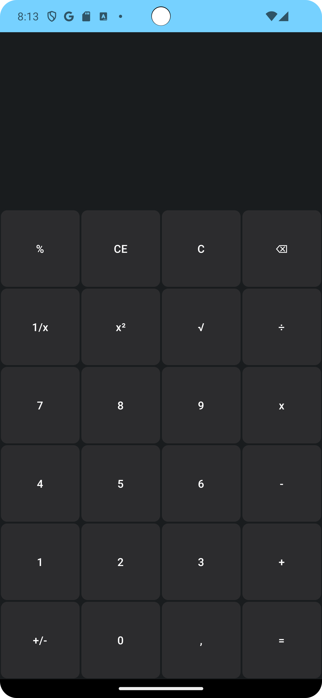
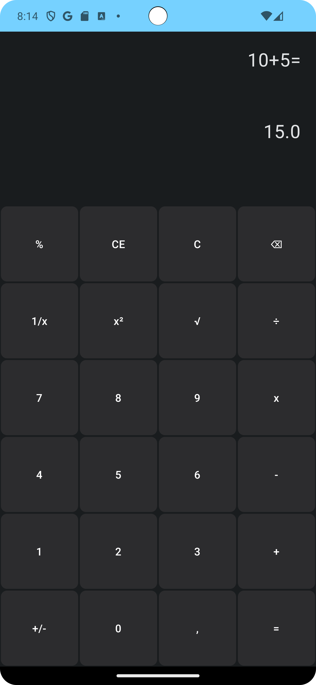
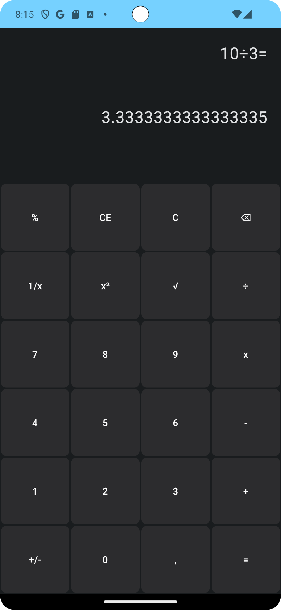

# SimpleCalculatorInJetpackCompose# Android Calculator
Project created for my practice.  
If you want testing this app just click on Clone project and open in your Android Studio. 
<b>Screnshots: </b> 
 
 
 

<b>Implemented functions:</b>

Function     |  Status
---------    |---------
Sum          | Done
Subtraction  | Done
Multiplication| Done
Division     | Done
Percent      | Done 
Invert Signal| Done
Clear        | Done
Cancel Entry | Done
